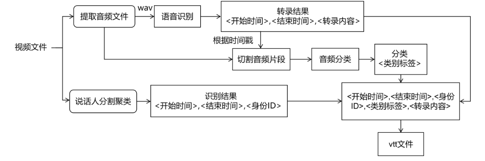
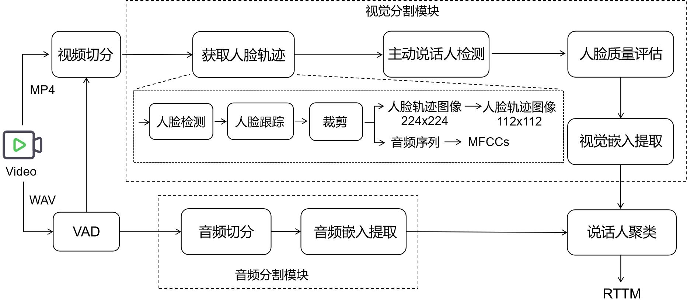

# EchoAccess (待完善文档)

结合主流技术，实现无障碍字幕自动化功能的实验探索

## 实验环境

- Windows 11
- Python 3.8.3

## 自动化字幕生成功能实现

### 技术路线

- 音频分类模型：PSLA框架

- 多模态说话人识别：3D-Speaker，一个结合CAM++和TalkNet的多模态说话人分割聚类处理流程

  

- 语音识别模型：Whisper模型

### 数据集

- MSDWild数据集：一个用于多模态说话人分割聚类任务的数据集

## 参考文献
- Gong Y, Chung Y-A, Glass J. PSLA: Improving Audio Tagging with Pretraining, Sam
pling, Labeling, and Aggregation[J]. IEEE/ACM Transactions on Audio, Speech, and Langua
ge Processing, 2021, 29: 3292-3306. DOI:10.1109/TASLP.2021.3120633.

- Liu Tao, Fan Shuai, Xiang Xu, et al. MSDWild: Multi-modal Speaker Diarization Da
taset in the Wild[C]//Interspeech 2022, September 18-22, Incheon, Korea. DOI: 10.21437/Inte
rspeech.2022-10466.

- Chen, Yafeng, Siqi Zheng, Hui Wang, Luyao Cheng, Tinglong Zhu, Changhe Song, 
Rongjie Huang, et al. "3D-Speaker-Toolkit: An Open Source Toolkit for Multi-modal Speaker
Verification and Diarization." [J/OL]. arXiv preprint, 2024: arXiv:2403.19971 [2024-03-29]. 
https://doi.org/10.48550/arXiv.2403.19971.
